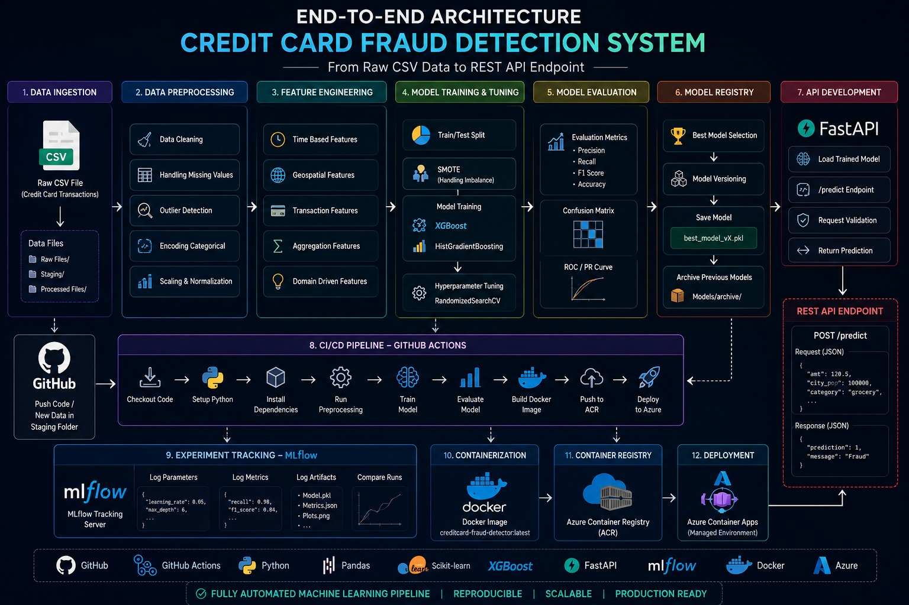
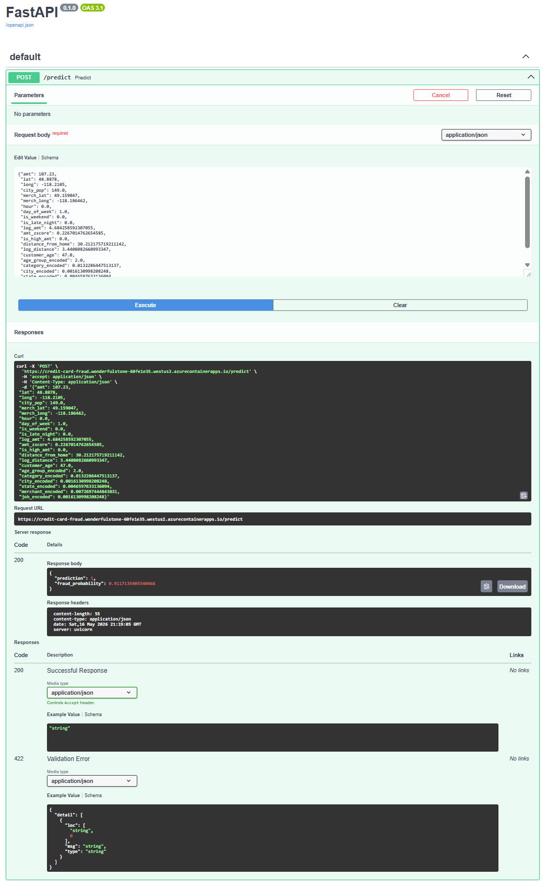
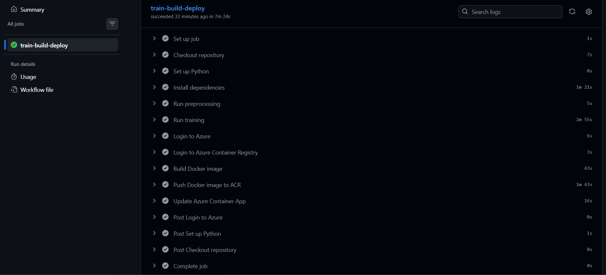
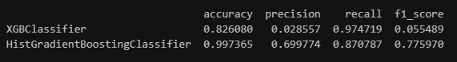

# Production-Ready Credit Card Fraud Detection System with CI/CD

An end-to-end production-ready machine learning system for real-time credit card fraud detection built using Python, FastAPI, Docker, GitHub Actions, MLflow, and Azure Cloud Services.

This project automates the complete ML lifecycle from raw CSV ingestion to a deployed REST API endpoint using CI/CD and containerized deployment workflows.

---

# Project Architecture

## End-to-End System Architecture



---

# FastAPI REST API

The trained model is exposed through a FastAPI inference API deployed on Azure Container Apps.

## FastAPI Swagger UI



### Endpoint

```http
POST /predict
```

### Example Request

```json
{"amt": 107.23,
 "lat": 48.8878,
 "long": -118.2105,
 "city_pop": 149.0,
 "merch_lat": 49.159047,
 "merch_long": -118.186462,
 "hour": 0.0,
 "day_of_week": 1.0,
 "is_weekend": 0.0,
 "is_late_night": 0.0,
 "log_amt": 4.684258592307055,
 "amt_zscore": 0.2267014762654585,
 "is_high_amt": 0.0,
 "distance_from_home": 30.212175719211142,
 "log_distance": 3.4408082660993347,
 "customer_age": 47.0,
 "age_group_encoded": 2.0,
 "category_encoded": 0.0132286447513137,
 "city_encoded": 0.0016130998208248,
 "state_encoded": 0.0046597633136094,
 "merchant_encoded": 0.0072697444843831,
 "job_encoded": 0.0016130998208248
}
```

### Example Response

```json
{
  "prediction": 0,
  "fraud_probability": 0.0234
}
```

---

# CI/CD Automation Pipeline

The entire workflow is fully automated using GitHub Actions.

Whenever a new CSV file is added into the staging folder, the pipeline automatically:

* runs preprocessing
* trains and tunes models
* selects the best model
* versions and archives previous models
* builds Docker image
* pushes image to Azure Container Registry
* deploys latest image to Azure Container Apps

## GitHub Actions Workflow



---

# Model Performance Comparison

The system evaluates multiple machine learning models and selects the best model based on Recall Score, prioritizing fraud detection and minimizing false negatives.

## Model Evaluation Results



---

# Tech Stack

## Machine Learning

* Python
* Scikit-learn
* XGBoost
* SMOTE
* Pandas
* NumPy

## API & Deployment

* FastAPI
* Docker
* Azure Container Registry (ACR)
* Azure Container Apps

## MLOps & Automation

* GitHub Actions
* MLflow
* CI/CD Pipelines
* Model Versioning

---

# Key Features

* Automated preprocessing pipeline
* Advanced feature engineering
* Fraud-focused model optimization
* Hyperparameter tuning using RandomizedSearchCV
* Automatic model versioning and archival
* FastAPI REST API deployment
* Docker containerization
* Azure cloud deployment
* GitHub Actions based CI/CD automation
* MLflow experiment tracking

---

# Workflow Overview

```text
Raw CSV Data
      ↓
Data Preprocessing
      ↓
Feature Engineering
      ↓
Model Training & Hyperparameter Tuning
      ↓
Model Evaluation & Selection
      ↓
MLflow Experiment Tracking
      ↓
Model Versioning
      ↓
FastAPI Application
      ↓
Docker Containerization
      ↓
Azure Container Registry
      ↓
Azure Container Apps
      ↓
REST API Endpoint
```

---

# Project Structure

```text
Production-Ready Fraud Detection System with CI CD
│
├── App/
│   ├── Dockerfile
│   ├── main.py
│   ├── requirements.txt
│   └── *.pkl
│
├── Data Files/
│   ├── Raw Files/
│   ├── Processed Files/
│   └── Staging/
│
├── Images/
│   ├── Detailed_Architecture.png
│   ├── FastAPI_UI.png
│   ├── Github_Actions_Workflow.png
│   └── Model_Performance_comparison_table.png
│
├── Models/
│   └── archive/
│
├── Python_Scripts/
│   ├── preprocess.py
│   └── train.py
│
├── .github/
│   └── workflows/
│
├── requirements.txt
├── README.md
└── .gitignore
```

---

# CI/CD Trigger

The pipeline automatically starts when a new file is added to:

```text
Data Files/Staging/
```

---

# Docker Deployment

## Build Docker Image

```bash
docker build -t creditcard_fraud_mlmodel ./App
```

## Run Docker Container

```bash
docker run -p 8000:8000 creditcard_fraud_mlmodel
```

Swagger UI:

```text
http://localhost:8000/docs
```

---

# Azure Deployment

The Docker image is deployed to:

* Azure Container Registry (ACR)
* Azure Container Apps

The application is publicly accessible through a REST API endpoint.

---

# Future Improvements

* Real-time streaming inference using Kafka
* Data drift monitoring
* Automated retraining
* Kubernetes deployment
* Feature Store integration
* Monitoring dashboards
* Advanced observability and alerting

---

# Author

## Vishnu Vardhan Reddy Alla

Data Science | Machine Learning | MLOps | Azure Cloud | CI/CD
